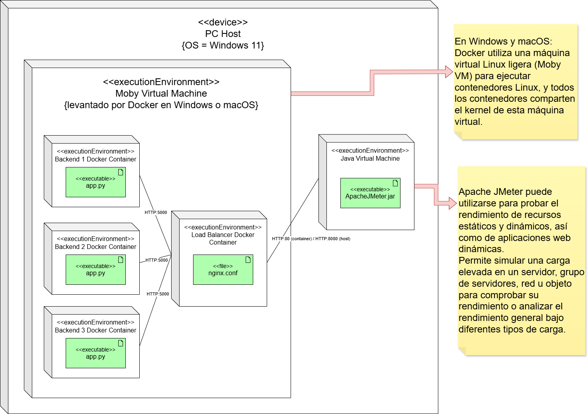

# 2025_1_ANDIS1_Load-Balancing-Demo

Grupo 1 - Demo de Load Balancing con Docker, nginx y Apache JMeter



## ¿Cómo ejecutar la demo?

1. Abrir Docker Desktop.

2. A nivel raíz del repositorio, ejecutar el comando ```.\commands\runContainers.bat```, esto encenderá los 4 contenedores Docker.

3. Utilizar Apache JMeter para abrir el archivo [Plan de Pruebas - ANDIS 1 - Load Balancer](./Plan%20de%20Pruebas%20-%20ANDIS%201%20-%20Load%20Balancer%20Nginx.jmx) y ejecutar las pruebas.

Para utilizar diferentes configuraciones de nginx, utilizar los archivos en la carpeta [load-balancing-configs](./load-balancing-configs/) y sustituir el contenido en el archivo [nginx.conf](./nginx/nginx.conf).

Ejecutar ```.\commands\restartLoadBalancer.bat``` para reiniciar el contenedor con nginx.